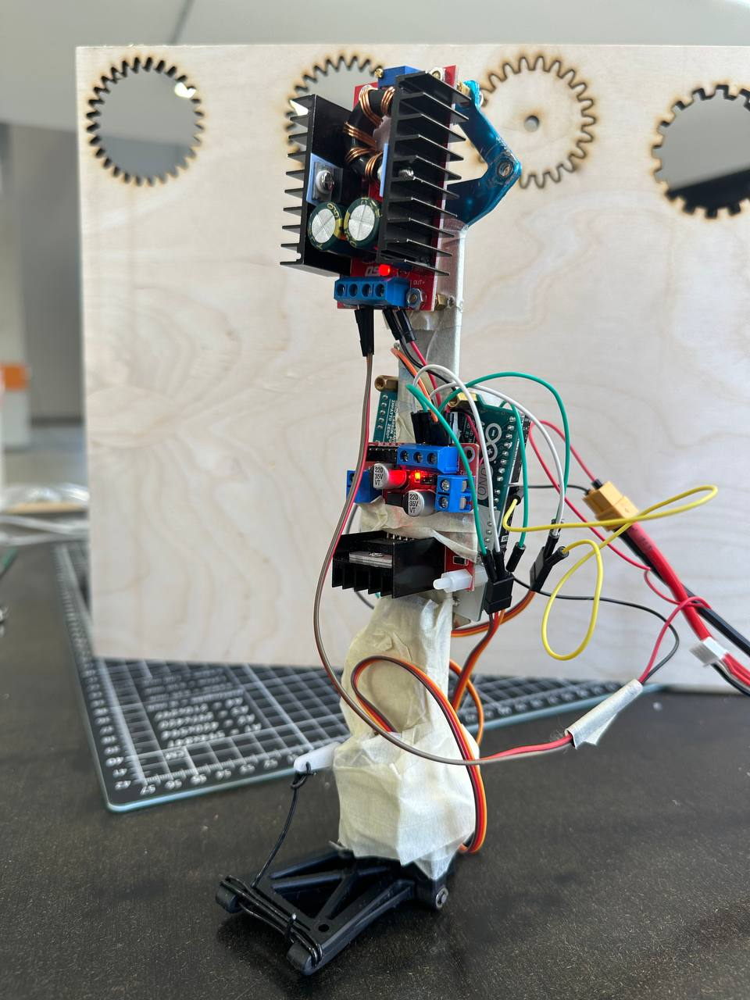
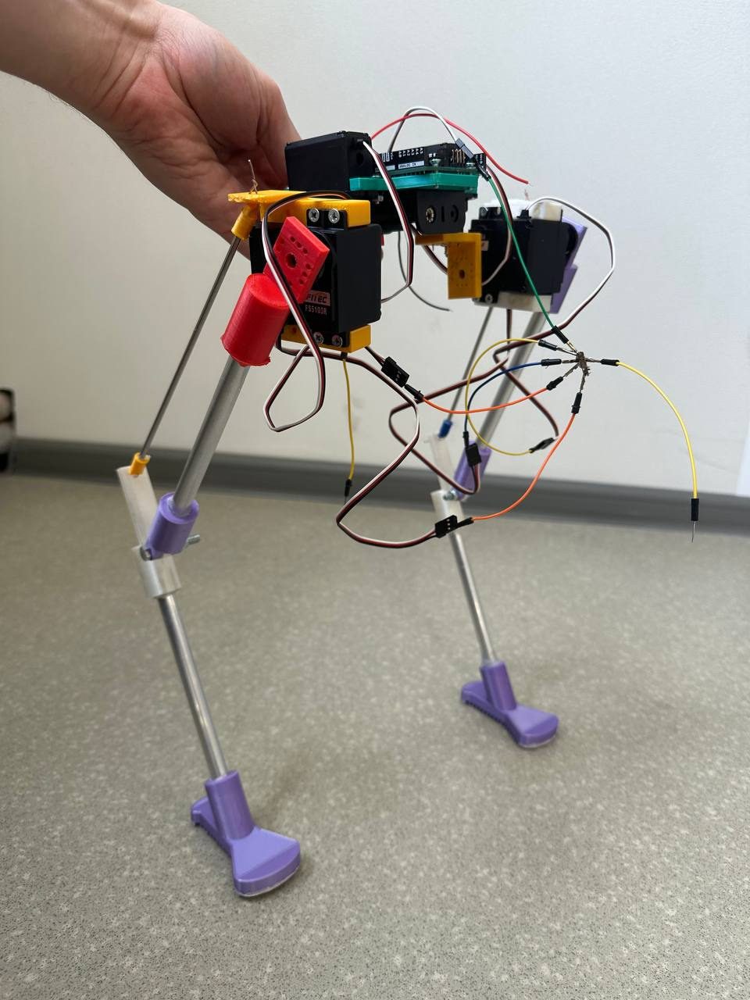

# Бипедальный робот

Проект по курсу "Проектирование, прототипирование и производство в проектном формате"

Данная работа посвящена построению двуногого робота, способного удерживать равновесие и шагать. Проект несёт образовательный характер для нашей команды: понимание проблем, возникающих при разработке подобных устройств, а также самостоятельное их решение - цель нашего проекта.

Описание проекта можно посмотреть в файле "bipedal.pdf"	

## Технические заметки и исходные файлы для печати
В папке STL&SLDPTR находятся файлы с 3D моделями основных компонент робота. Далее приведено их краткое описание. 

С целью упрощения управления прототипами, а также более эффективного распределения сил команды, было решено разделить проект на две части: 
### 1) Разработка активного голеностопа

### 2) Разработка основной механической конструкции робота
 

